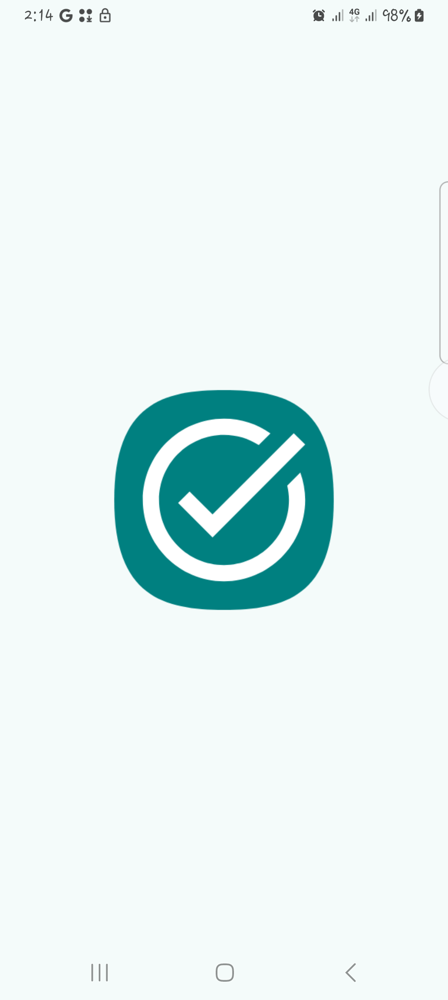

# Achivit-App

It is a work in progress 🚧.

A planner app...

<!--  -->

## Demo Video
Click the image below to get the video 👇🏽

<!--  -->

<!-- <table>
  <tr>
    <td>
      
    </td>
    <td>
      
    </td>
    <td>
      
    </td>
    <td>
      
    </td>
  </tr>
</table> -->

## Features
- Offline-first data using Room Database and Cloud Firestore
- Pagination with Paging 3
- Efficient Search functionality using Full Text Search (Ft4)
- Complex Database Relationships: One-to-Many, Many-to-Many, and Many-to-One
- Asynchronous work with Coroutines
- Persistent work with Work Manager
- Schedules/Reminders with Alarm Manager
- Network Connectivity monitoring
- In-App Notifications
- Beautiful and minimalistic UI with Jetpack Compose
- Filter Tasks
- Dark/Light Themes

## Tech Stack, API and Libraries used
+ Room Database
+ Firebase Firestore & Google Auth
+ XML and Jetpack Compose
+ Alarm Manager
+ Coroutines
+ Work Manager
